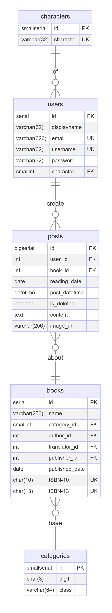

# Design Document

Pei-Yi Lin

Video overview: <https://youtu.be/-KFQ9WbfKrI>

## Scope

The database aims to collect basic information about books and gather feedback from readers. Therefore, the scope includes:

* Characters: The role of various users such as reader, writer, and publisher.
* Users: Basic identifying information of individuals.
* Posts: Users' thoughts and feedback about the books they have engaged with.
* Books: Basic information about each book stored within the database.
* Categories: Classification of books based on the Dewey Decimal Classification system.

The scope of the database includes books and people in Taiwan. Support for individuals worldwide is not currently included.

## Functional Requirements

The database will support:
* CURD operations for users and books.
* Search for books that other users have read, and find opnions and reviews from other users about thoes book.
* Create posts to share their own opinions and reviews about books.

## Representation

### Entities

The database includes the following entities:

#### Characters

* `id`, which specifies the unique ID for the character as a `SMALLSERIAL`, a small auto-incrementing integer type that ranges from 1 to 32767. This column also serves as the `PRIMARY KEY`.
* `character`, which specifies the user's role, such as `Reader`, `Writer`, or `Publisher`, using `VARCHAR(32)` to allow up to 32 characters.

#### Users

* `id`, which specifies the unique ID for the user as a `SERIAL`, an auto-incrementing integer type that ranges from 1 to 2147483647. This column also serves as the `PRIMARY KEY`.
* `displayname`, which specifies the name the user wants to be called by, using `VARCHAR(32)` to allow up to 32 characters.
* `email`, which specifies the user's email address, using `VARCHAR(320)` to allow up to 320 characters.
* `username`, which specifiies the user's account name, using `VARCHAR(32)` to allow up to 32 characters. A `UNIQUE` constraint ensures no two users have the same username.
* `password`, which specifies user's password, using `VARCHAR(32)` to allow up to 32 characters.
* `character`, which specifies the user's character code, stored as `SMALLINT`. This column also functions as a `FOREIGN KEY` referencing the `Characters` table.

#### Posts

* `id`, which specifies the unique ID for each post as a `BIGSERIAL`, an auto-incrementing integer type that ranges from 1 to 223372036854775807. This column also serves as the `PRIMARY KEY`.
* `user_id`, which specifies the user's identity, stored as `INTEGER`. This column also functions as a `FOREIGN KEY` referencing the `Users` table.
* `book_id`, which specifies the book's identity, stored as `INTEGER`. This column also functions as a `FOREIGN KEY` referencing the `Books` table.
* `reading_date`, which specifies the date the user read the book, stored as `DATE`.
* `post_datetime`, which specifies the date and time the post is created, stored as `DATETIME`. The dafault value is the current timestamp, as denoted by `DEFAULT current_timestamp`.
* `is_deleted`, which specifies whther the post is deleted or not, stored as `BOOLEAN`.
* `content`, which specifies the user's thoughts about the book, using `TEXT` to allow variable length without limit.
* `image_url`, which specifies the image source related to the post, using `VARCHAR(256)` to allow up to 256 characters.

#### Books

* `id`, which specifies the unique ID for each book as a `SERIAL`, an auto-incrementing integer type that ranges from 1 to 2147483647. This column also serves as the `PRIMARY KEY`.
* `name`, which specifies the book name, using `VARCHAR(256)` to allow up to 256 characters.
* `category_id`, which specifies the book's category code, stored as `SMALLINT`. This column also functions as a `FOREIGN KEY` referencing the `Categories` table.
* `author_id`, which specifies the author's identity, stored as `INTEGER`. This column also funtions as a `FOREIGN KEY` referencing the `Users` table.
* `translator_id`, which specifies the translator's identity, stored as `INTEGER`. This column also functions as a `FOREIGN KEY` referencing the `Users` table.
* `publisher_id`, which specifies the publisher's identity, stored as `INTEGER`. This column also functions as a `FOREIGN KEY` referencing the `Users` table.
* `published_date`, which specifies the book's published date, stored as `DATE`.
* `ISBN-10`, which specifies the book's ISBN-10, stored as `CHAR(10)`. Either ISBN-10 or ISBN-13 must be filled.
* `ISBN-13`, which specifies the book's ISBN-13, stored as `CHAR(13)`. Either ISBN-10 or ISBN-13 must be filled.

#### Categories

*`id`, which specifies the unique ID for each category as a `SMALLSERIAL`, an auto-incrementing integer type that ranges from 1 to 32767. This column also serves as the `PRIMARY KEY`.
*`digit`, which specifies the digit repesentation of the main class, stored as `CHAR(3)`, with 3 digits ranging from 000 to 999.
*`class`, which specifies the main class of book classification, based on the Dewey Decimal Classification, stored as `VARCHAR(64)`

### Relationships

The below entity relationship diagram describes the relationships among the entities in the database.

As detailed by the diagram:
* Each character can be assigned to zero or multiple users. It's zero if the cahacter hasn't been assigned to any users yet, and it's multiple if the character is assigned to more than one user. Each user will be assinged one character.
* Each user can create zero or multiple posts. It's zero if the user hasn't created any posts yet, and it's multiple if the user creates more than one post. Each post must be created by exactly one user.
* Each post is related to one book. Each book may be mentioned in zero or multiple posts. It's zero if the book has not been mentioned in any posts, and it's multiple if the book is mentioned in more than one post.
* Each book is classified into one category. A category can have zero or more books. It's zero if the category does not have any related books, and it's multiple if the category has more than one related book.

## Optimizations

As per typical queries in `queries.sql`, users often search for basic information about books. To speed up the identification of a given book, an index is created on the `name` column of the `books` table.

Similarly, users frequently search for other users. To expedite the identification of a given user, an index is created on the `displayname` column in the `users` table.

Additionaly, it's common for users to search for others' thoughts about a specific book. To accelerate the identification of posts related to a given book, an index is created on the`book_id` column in the `posts` table.

## Limitations

Author, Translator, Publisher who are not registered on this platform will have their basic information displayed only through their display name. Their email, username and password do not exist in out database.
